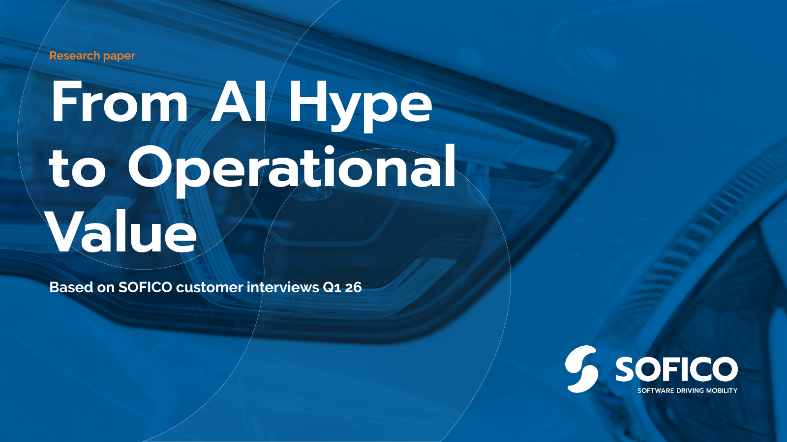

## SOFICO's marketing team needed writing that could keep up with the subject

SOFICO makes the software automotive finance runs on. Its Miles platform manages the contracts behind leased and financed vehicles, from the first quote to the vehicle's end of life, for leasing companies and the finance arms of car brands. SOFICO has its own marketing team, and what that team needed in January 2024 was someone who could write about this world without getting lost in it.

The first job was small: the copy for a partners page. The second one showed what the work would look like. In May 2024 SOFICO wanted a blog about NIS2, the EU's cybersecurity directive, and regulation is exactly where marketing writing tends to go vague. So I went to the sources, pulled the numbers, linked every one of them, and Stéphanie from SOFICO's team proofread it before it went out.

That set the pattern for everything after it. SOFICO came back project by project: campaigns, a mission and vision statement, a tone of voice pass, newsletters, landing pages, and an anonymised customer story about a premium car brand that standardised its finance and lease pricing across app, web and showroom. Each one was a subject SOFICO's team knew inside out and needed written up by someone who could keep up.

## Twelve interviews someone else ran, turned into one argument

In the spring of 2026, SOFICO wanted to know where automotive finance stands on AI. A consultancy had already interviewed twelve leaders from six leasing companies and five captive finance units for them in the first quarter, and SOFICO asked me to turn those conversations into a report. I didn't run or sit in on any of them. What I worked from was about 9,300 words of notes written up from the recordings, organised the way interviews are: one company after another, each with its own summary and its own verbatims.

That order suits the people who ran the interviews. A leasing executive will read what their peers said with interest, but what they need from a report is where the industry stands as a whole and where their own company fits. So the first call was to take the notes apart and rebuild them by theme: where adoption stands today, what's holding it back, where the opportunities are, and a roadmap to close. I wrote the outline in April and most of the report in May, with feedback along the way from Lore, Borek and others on SOFICO's team. The writing meant choosing the quotes, building the bridges between chapters, and tracing every claim back to its source.

The second call was the tone. The easy version of an AI report tells the reader they're falling behind. The interviews did show that automotive finance sits behind other industries, but they also showed why: heavy regulation, long technology cycles, and an industry that has usually done well by letting others take the early risk. So the report says both. It names the gap, treats the caution as a rational starting point, and spends most of its length on what the organisations that got past their pilots did differently. Every quote carries a company type and a region rather than a name, which let the leaders speak plainly and keeps SOFICO's customers out of it.

Once designed, the report grew from 17 pages of text to 42. I also built the first version of its landing page with Claude in about half an hour, by feeding it the paper, the vault I keep on SOFICO's positioning, voice and proof points, and their live site for the design. Two elements came out and a few lines changed.

## SOFICO's real competitor is the system already in the building

Ask a software company who it competes with and it names other vendors. SOFICO has those, but they're not the main alternative a buyer weighs. That's the contract system a leasing company has run for years, the in-house build someone wrote long ago, and the understandable reluctance to touch either.

We worked that out in recurring one-hour positioning calls from June 2026 onward, and they were hard sessions. A rival product is easy to position against, because you compare features. Positioning against the status quo means answering the questions buyers ask themselves: what will this cost us over time, what happens during the switch, and will the platform keep up with whatever the market asks for next.

The structure came on a walk. On 16 June, after a morning of getting nowhere, I went out, rethought the plan from scratch, and came back with three pillar pieces and four deep dives, each answering the legacy alternative from its own side and each linked to blogs SOFICO had already published. Predictability takes on cost: a subscription you can plan against, next to the bill for running your own system that nobody ever adds up. Migration takes on the switch itself. Expanding with the market takes on whether the platform keeps up.

The data quality pillar ties back to the report, and it's where one more call came in. It cites only SOFICO's own findings from the interviews, and none of the Deloitte or Eurostat figures the report used for context. Anyone can quote those numbers. Twelve conversations with the people who run leasing books are the part nobody else has.

The pieces went through review rounds with Lore, Borek and people across SOFICO's product and sales teams, including sales in Iberia. In August the same positioning turned into a set of LinkedIn ads.

## A report the account executives send out themselves

"From AI hype to operational value" is live on sofico.global, linked from the main navigation and the footer, and in early September it held the headline spot on SOFICO's homepage. The result I value most is harder to see from outside. In August, Lore told me the report had landed well internally and that SOFICO's account executives were sending it to their own contacts. When a sales team forwards marketing's research without being asked, that's the best proof I know that it's useful.

What SOFICO has now is research of its own to open conversations with, a positioning that answers its biggest competitor head-on, and a content plan where every new piece has a place: a pillar it supports, the deep dives it points to, and the existing blogs it links.

## I'd gather the context before the first draft, not during it

Automotive finance puts a lot of parties in one sentence. A captive finance unit belongs to a car brand, sells through dealers, and might run its contracts on SOFICO's platform, a competitor's or one it built itself. A leasing company might buy from any of them. Keeping straight who does what, between SOFICO, its customers and everyone around them, is one of the hardest parts of writing for this market, and it's easy to get mixed up.

So what I'd do differently is bundle the context up front: my notes from every call, the industry news, and who does what, all in one place before the first draft instead of gathered piece by piece along the way. I work that way now. The SOFICO vault holds the positioning, the vocabulary, the proof points and the people, and it's the reason a landing page could take half an hour.
