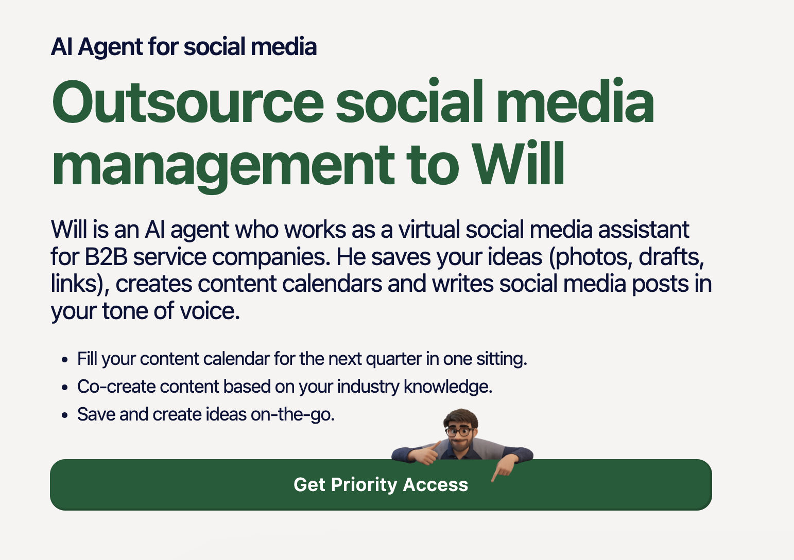
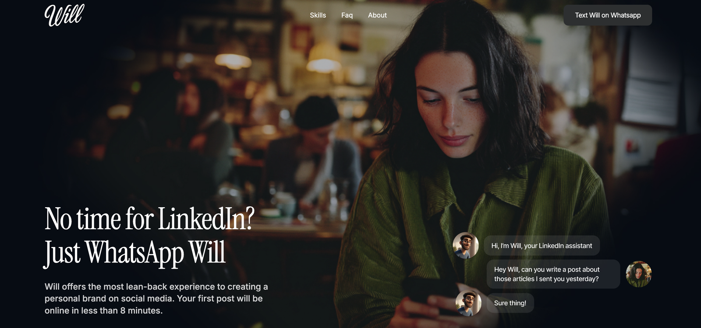

## A spin-off with a waitlist page and no marketing behind it

Will began inside Willow, the AI social media platform for professional-services firms where I already worked. The idea was an AI agent people could hand their social media to, and it grew into a product of its own, with its own name, its own site and its own launch. As a brand-new product, it also started with no marketing at all.

Its first page shows where the thinking stood. Will was "an AI agent who works as a virtual social media assistant for B2B service companies": he saved your ideas, built content calendars and wrote posts in your tone of voice, and a "Get priority access" button collected names for later. Everything on it was true, but it asked a visitor to picture an agent, an assistant, a content calendar and a quarter's worth of posts before they'd seen a single one.

*Will's first page, before launch: a virtual social media assistant for B2B service companies, with a priority-access button instead of a way to try it.*

I did the go-to-market together with Ludwig, Willow's CEO. He focused on the commercial side, and I took the content: the website copy, the videos and the social posts. We both had a hand in the product too, from which features came next to which campaigns ran and how the launch came together.

## One app, one job, a first post in under eight minutes

By launch, Will's promise had shrunk to a single job in an app people already have open all day: "No time for LinkedIn? Just WhatsApp Will." Will reads your last fifty LinkedIn posts to learn how you write, and from then on a voice note or a few bullet points in WhatsApp is enough to get a post back. There's no dashboard to learn and no new app to install, and the homepage promised your first post online in less than eight minutes.

With a promise that narrow, every page on the site had the same job: show why WhatsApp is the easiest place to get a LinkedIn post written. I worked out the branding and messaging for the homepage with a Webflow designer, then built the rest of heywill.ai and its blog myself.

*heywill.ai around launch: one app, one job, and a chat that shows the whole product in three messages.*

## Tracking sign-ups in an app with no screens

Most software launches lean on a sign-up form. UTM tags go in, a conversion event comes out, and the analytics show which channel brought in whom. Will didn't have a form. A new user tapped a link or scanned a QR code, WhatsApp opened with a message ready to send, and that conversation was the sign-up.

So the tracking moved into the words. Each link ran through a link shortener and opened WhatsApp with a slightly different first message: one said "Hey, how can you help me?", another "Hi Will, how can you help me?" When a message came in, its wording told us where the person had come from. Anyone who rewrote the message before sending it dropped out of the data, but about nine in ten sent it exactly as written.

That first message was also the whole onboarding. With no welcome screen or product tour, the opening exchange had to do all the persuading, so we A/B tested the first message over and over to find the versions that kept people talking. YouTube explainers covered what a product tour would normally show, and a friend I'd worked with before helped with the more entertaining videos.

## SuperNova first, then Product Hunt

Will's first public outing was SuperNova, the tech festival in Antwerp, where we went to promote it and collect the first sign-ups. The public launch followed on Product Hunt on 11 April 2025.

I coordinated the Product Hunt launch. Will didn't make the day's top ten and didn't get featured, but the day delivered what a launch day is for: the posts we'd prepared for each social platform sent a wave of people to try Will.

After launch, LinkedIn ads took over the job of finding new users. I ran them as a structured test on a small budget, setting creatives, ICPs and USPs against each other instead of changing one variable at a time. Each angle got its own ad group and its own landing page, so every visit showed which promise had brought the person in: chatting with Will, or a first post in five minutes.

## 1,400 trial starts, and a lot to take back to Willow

Over 1,400 people have started a free trial of Will since launch. That's a real audience for a product nobody had heard of at the start of 2025, but I wouldn't call the launch a success.

Will's bigger return was on the product side. What we learned from building and running an AI agent that lives inside a chat went into the development of Willow Create, which launched in June 2026. (That part of the story sits in the [Willow case](/work#willow).)

## What I'd do differently: give early users a way back in

I'd have pushed much harder for a freemium plan. Will launched with a free trial of a week or two, and the product moved fast after that, with a steady run of new features and improvements in the first months. The people who signed up first tried Will while it was still in its infancy, used up their trial, and then couldn't try the better version without paying for it. Some of them were exactly the early ambassadors a new product needs, and we couldn't convince them to come back. A free plan would have let them return once Will had caught up with its promise.
