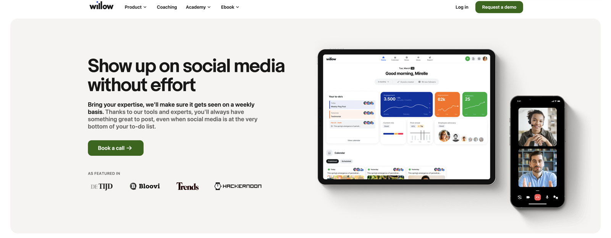
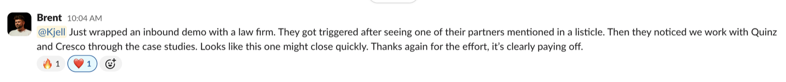
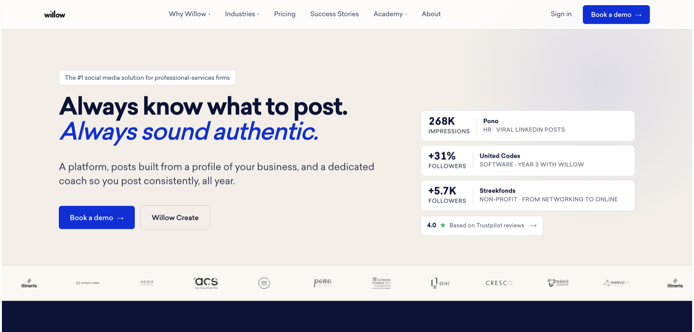

## 2024: learning the product from the customer side

I joined Willow on 27 March 2024 as a customer success manager, four days a week. The job came through LinkedIn: Orisa, a former colleague I hadn't spoken to in five years, had been reading my posts and put my name forward. (Worth remembering next time I wonder whether posting is worth the effort.)

Willow sells an AI social media platform to professional-services firms, and my customers were the people using it: accountants, recruiters, IT firms and consultancies across Belgium and the Netherlands. Most of them knew they should post more and kept not doing it. So my first months went into coaching sessions and presentations on social media marketing, the kind that turn a vague intention into a calendar someone follows.

Together with Ludwig, Willow's CEO, and the rest of the team, I also helped rethink how Willow coaches its customers and how that coaching is priced. Customer success moved to freelance success managers who own their portfolios, and on the cheaper contracts, monthly coaching calls became quarterly. By the summer, marketing tasks had started landing on my desk as well, and everything I'd heard in those customer calls came with me.

## Early 2025: a cleaner website, then a customer story every week

At the start of 2025, willow.co looked its age. The design was dated, a lot of the content was out of date, and a company selling social media had surprisingly little of its own. Search told a similar story. The site still drew decent traffic, but the blog archive ranked for SEO, Google My Business and general digital marketing, which brought the wrong visitors to a social media company.

*The willow.co homepage in January 2025: a green design, a product dashboard in the hero, and the promise to "show up on social media without effort".*

So the first half of the year went into cleaning up rather than starting over. Every page on the site had drifted into its own style, so I narrowed the styles until the pages looked like one site again, took outdated pages offline, and sorted out blog posts that contradicted each other. A content refresh and weekly posts on Willow's own channels came alongside.

The part that lasted was the case studies. From April 2025 I published one customer story every week. Every story started where we already had data: HubSpot and Chargebee for the timeline, the Willow platform for how the customer posted and what it did for them, call notes for their own words. I dumped all of it into one file, let a custom GPT question me until the angle was clear, edited the draft, and sent it to the customer with a short Tally form. It asked three things: are you happy with the story, is there anything to add, and how was working with us? The answers to that last one gave me the best quotes. Ludwig usually beat me to sharing each story by letting Will post it to his profile. I wrote up the whole process in [how I publish one success story every week](/blog/how-i-publish-one-success-story-every-single-week-and-how-you-can-too).

Will itself, Willow's AI agent for LinkedIn, launched in the same stretch. That's [a story of its own](/work#will).

## Late 2025: giving sales something to close with

Willow's customer stories turned from a weekly habit into sales material in the second half of 2025. There were nearly 20 by September, and I've written more than 40 by now. The clearest sign they worked came from Brent in sales, toward the end of the year. A law firm booked an inbound demo after spotting one of its partners in a listicle, then found stories on our site about firms like theirs, and Brent messaged me that this one might close quickly.

I spent the autumn automating around those stories. In October, nine of us at Willow shared 180 LinkedIn posts built from our customer stories in 20 days, and most of the plumbing behind it was n8n: a pipeline that turned case studies and customer profiles into finished posts, with images and a check that caught typos before anything went out. The reach was lower than we'd hoped, and I said so when I [published what we learned](https://www.willow.co/blog/case-study-experiment). Short, story-first captions beat long ones, simple visuals beat infographics, and the first two weeks beat the last two as the team's own engagement tailed off. Those tests fed into what became Willow Create, the product team's version of the same idea.

A second flow put the stories to work in sales. A prospect answered three questions in a Tally form: what the business does, how big the team is, and what its biggest challenge is. n8n matched those answers to the closest customer stories and drafted a personal email from Brent with those stories, the Willow features that fit the prospect's situation, and three quick best practices they could use straight away. So every prospect who filled in the form got proof from firms like theirs in the very first email. The build itself was simple, and designing the workflow took most of the thinking. By the end of October the same idea ran behind Willow's lead magnet: fill in the form, get a personalised email back.

The rest of the year was classic marketing: SEO and schema fixes on the site, a launch campaign for tagging personal profiles in posts (press release, support page, product update and press outreach), and Willow's stands at Tectonic in Ghent, where we booked demos, and at the ITAA congress for accountants in Brussels.

In December I laid the groundwork for Willow's comparison pages. Buyers compare Willow with scheduling tools like Later and Hootsuite anyway, so I built a comparison hub in Webflow's CMS that lets them do it on our site. Willow always takes the first column, a visitor picks up to three competitors to set next to it, and adding a new tool takes one field in the CMS. The first head-to-head pages, Willow against Later and against Hootsuite, were in the works by the end of the year.

## Early 2026: turning Willow's own data into proof

Willow's platform holds years of posting data, and in early 2026 I started turning it into proof. In January I built Sally, a Slack bot the whole team can ask about our customers: which ones work in IT, who had the most impressions last year. Every new or updated success story syncs to a database behind it, and a day later Sally was answering visitors on the success stories page too.

In March that data became a consistency report. Its main finding: posting close to once a week is the threshold below which growth stalls. One report became social posts, articles and customer emails, a Dutch version for law firms with our partner Jubel, and an English law-firm edition at the end of the month. (More on that approach in [how to build a content engine](/blog/how-to-build-a-content-engine).) Four more customer stories went out that month, and Pono's second story, about posts that went viral, followed in May.

April was about systems. I set up a five-agent content system in Willow's own Claude, connected to Notion and Webflow, plus skills for case studies, Dutch translations and comparison pages. With research from Diana, I also completed the comparison pages the hub had been built for. I used GA4 to find the blog posts nobody visited, archived the weakest and merged the rest into the course content. The onboarding emails new customers receive finally shipped too, a few weeks later than I'd planned.

For the June launch of Willow Create, I produced the launch material: twelve teaser videos, product videos, testimonial videos with Itineris and WeevoHR, a logo made with Claude, a custom audio track, and a one-pager for past customers.

Willow Create mattered for retention too. When I joined, Willow's net revenue retention sat at 82%: for every €100 of recurring revenue at the start of a quarter, about €82 was left at the end of it. The coaching and pricing changes of 2024 helped, but the product also had to catch up with what AI had taught customers to expect. By the first quarter of 2026, with the first customers testing Willow Create, net revenue retention reached 89%, the highest Willow has recorded, and January was the first month since late 2023 with more customers gained than lost. That's a team result, and the product did the heavy lifting.

82% → 89%

Net revenue retention, Q1 2024 to Q1 2026. A team result, and the highest Willow has recorded.

Jan 2026

The first month since late 2023 with more customers gained than lost.

## Mid 2026: rebuilding willow.co in a month

In the summer of 2026, Willow got a completely new website: a new design, a new build, and a move off Webflow. Ludwig designed the new look and handed me the design files on 6 July, and I built the rest in Claude and Claude Design, working from a shared Claude account. By launch, the English site ran to around 290 pages: the homepage and pricing page, 44 customer stories, 87 blog posts, 65 course chapters, 28 comparison pages and 44 support articles. Along the way I improved the comparison pages and generated new images for the resources page with OpenAI. The site's images still loaded from Webflow's servers, 384 of them, so I moved those onto the new site too, and set up redirects so every old link kept working. The Dutch versions followed within days of launch, which takes the site to more than 580 pages today.

On 7 August, Koen, Willow's CTO, and I ran the migration together at half past one, and fifteen minutes later the site was live on Netlify. After launch I ran an Ahrefs audit and fixed what it flagged: redirects, meta descriptions, a few 404s. Google's PageSpeed test now scores the homepage 90 for performance and 100 for accessibility, best practices and SEO. Search traffic came through the switch intact, with 901 clicks in the four weeks after launch against 895 in the four weeks before.

*The rebuilt homepage in August 2026, leading with customer results from Pono, United Codes and Streekfonds.*

With the site in code, the content work got faster. Since launch I've refreshed Willow's Six Pillars ebook with our own research and written ebooks on employer branding and personal branding for CEOs. The skills from April finally came into their own too. The blog pipeline published its first fully automated post on 21 August, and the case-study and Dutch translation skills now write straight into the site.

I also set the site up to keep itself in check. Every deploy runs three gates: one stops internal files from going public, one fails the build when a page re-implements styles the shared stylesheet already owns or ships images without alt text and dimensions, and one fails it when the documented design standards drift away from the stylesheet. A parity check keeps each Dutch page structurally identical to its English twin, and it earned its place on the first run, when nine of thirteen Dutch pages had drifted. On top of that, a weekly routine reads a batch of Dutch pages against the English originals to catch meaning drift and glossary slips, and the comparison pages get a regular review. When a contrast bug slipped through in early September, I added a skill so it can't happen again.

## What I'd do differently

I'd have fixed the foundation before automating the blog. In 2025 I built two n8n flows for Willow's blog. One rewrote old posts into a question-and-answer format that was supposed to do better in AI search, and because I let it run without reviewing each post, the results came back average: some better, some worse, most unchanged. The other turned blog posts into social content. That one worked, but getting posts and images from n8n into Webflow never ran smoothly, so it cost nearly as much time as it saved.

In 2026 the order flipped. First the site moved into code, then I built skills that know Willow's voice, and only then did I automate, with me reviewing what goes out. That's when the blog pipeline started working. Next time I'd start in that order, and keep a person on anything that carries the brand's voice. (More on where to draw that line in [how I use AI for B2B marketing](/blog/how-i-use-ai-for-b2b-marketing).)
