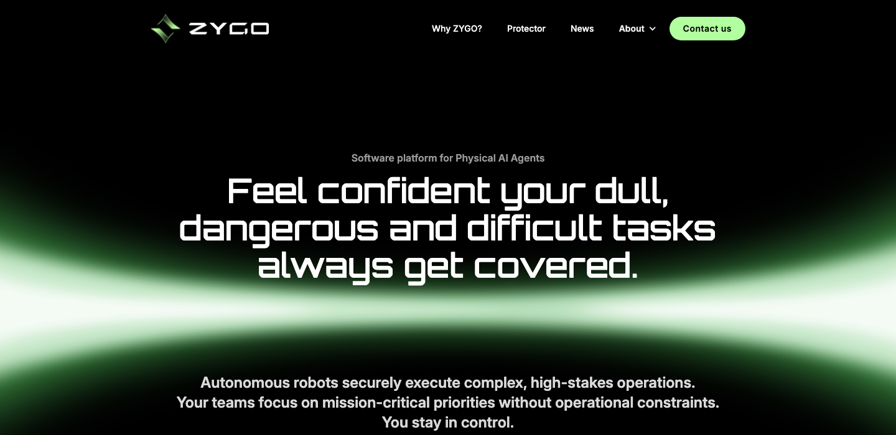
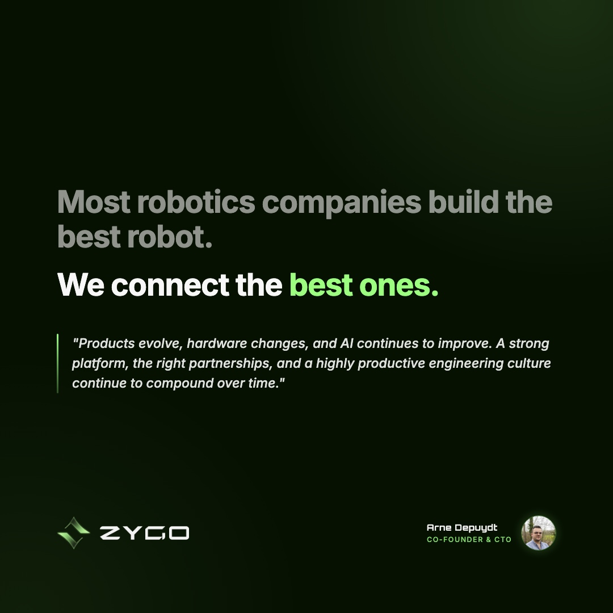

## Technical founders, a seed round to announce and no marketing function

I joined ZYGO in the middle of February 2026 as its part-time marketing and growth lead, the first new person on the team that year. ZYGO builds the software that lets robots take on dull, dangerous and difficult work, starting with Protector, an autonomous perimeter security solution that runs on a quadruped from its hardware partner inMotion Robotic. The founders, Erik (CEO) and Arne (CTO), had built a team of embedded engineers, navigation specialists and developers, with Altin on UI design. What nobody was doing was marketing. So I dived straight into the first job on the list: the press release for the seed round ZYGO announced four weeks after I started.

The work never had a long strategy phase up front. It ran as a string of projects, each started when the company needed it next: the launch, the website, the CRM and the content.

## The launch: two announcements a week apart, and a way to see who came looking

Before anyone could write a press release, ZYGO needed one agreed way to say what it sells. That part went quickly, because Erik already had a clear picture of what ZYGO was and what it offered. What we still had to find was the right word for it. Robotics company, software company and platform were all on the table, and "operating system" got dropped because ZYGO does more than the OS layer. The seed announcement went out on 13 March describing ZYGO as a software platform for Physical AI agents, and that's still how the site introduces the company today.

I wrote that press release, and a week later a second one, in which ZYGO and inMotion Robotic unveiled Protector together. De Tijd ran the seed story the same day it went out. On LinkedIn, Erik and Arne announced the round on their own profiles as well as on the company page, and their two personal posts became the most-engaged posts across all three accounts in ZYGO's first fourteen weeks.

A launch is also the moment people come looking, so it needed a way to see who they were. I put Rybbit on the site for visitor analytics on the day it went live, then added Snitcher in early April, which names the companies behind anonymous visits. That second tool is what later made the CRM worth building.

## The website: rebuilt with Altin and live a day before the announcement

Altin, ZYGO's in-house UI designer, designed the new site. I wrote the copy, planned the pages and built a good share of it with him in Webflow, and it went live on 12 March. The first version carried what the launch needed: a homepage, a Protector page, and investor and press pages to hold the releases and the coverage that followed.

The site kept growing after launch. Contact and about pages came next, then a careers section with a page per role and application forms in Tally that forward straight to Erik and Arne, a route for spontaneous applications, a custom cookie banner, and a round of SEO fixes from an Ahrefs audit.

Careers turned out to be the surprise. Between April and late June it was the second-busiest page on the site after the homepage, with the AI engineer role right behind it.

## The CRM: one Attio workspace for sales, hiring, press and, later, robots

In April, ZYGO's relationships still lived in the founders' inboxes. I set up Attio with separate lists for sales, recruiting, press, and partners and suppliers, and cleaned up the entries it had created automatically. The website's contact form now feeds straight into the right list, and Snitcher adds the companies it spots on the site.

Once the system of record existed, the next systems landed on it. In July, Erik, Arne and I mapped how a robot moves from order to activation, and I built a first version of that tracking inside Attio. Where it goes from here is still open. ZYGO could keep building on Attio, move to a dedicated ERP, or build a tool of its own. To test that last route, I've mocked up an interface with Claude, which Anthony, ZYGO's back-end developer, could take further if that's the way ZYGO goes.

## Social media: a company page and two founders, each with their own voice

ZYGO publishes from three LinkedIn accounts: the company page, Erik's and Arne's. We decided from the start to build the founders' profiles alongside the company's, because all three were starting from a small following. So each account gets its own content plan. Erik writes from the CEO's seat about business development and fundraising, Arne about the platform and the engineering calls behind it, and the company page covers ZYGO itself.

Most of the social content builds on longer pieces on the website, and those start with interviews. In April I sat down with most of the team, from the embedded engineers to Arne and Altin, to talk about how they work with AI and alongside robots, and with Erik in June. The first piece to go live was a blog on [what AI-native engineering looks like at ZYGO](https://www.zygo.be/news/engineering-at-zygo), and the longer pieces for investors and buyers are built the same way. The rest of the feed is the day-to-day of a growing company: events like Hannover Messe, new colleagues joining, and the robot footage I film with the team, which draws some of the widest reach ZYGO gets.

In the first fourteen weeks, from 18 February to 27 May, the three accounts published 44 posts, reached 16,834 impressions and grew their combined audience by 58%. ZYGO now gets a regular one-page social and website report, so the founders can see what's working without logging into anything.
